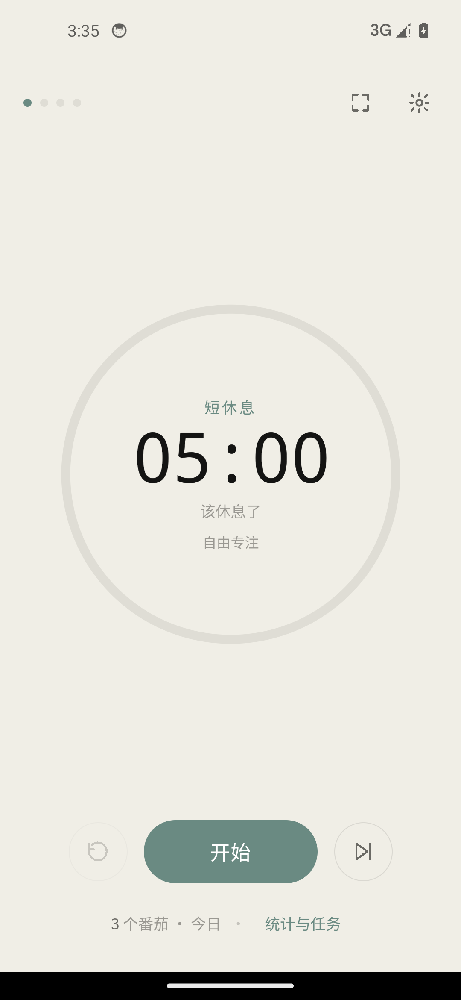
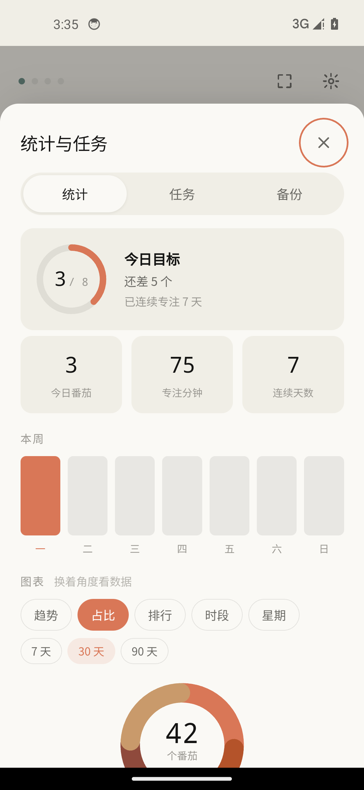
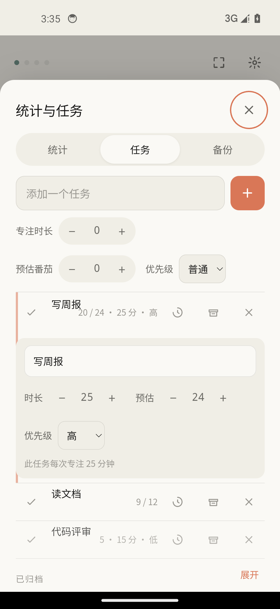
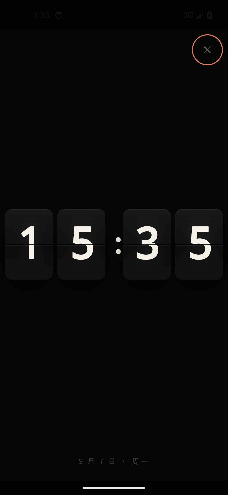

# 番茄钟 🍅

一款手机 / 平板兼容的 Android 专注计时 App。Capacitor 8 + 原生 HTML/CSS/JS，零前端框架、零图表库、零音频文件。

暖米白浅色主题，配一枚全屏黑色机械翻页时钟。

<p align="center">
  
  
  
  
</p>

## 下载安装

到 [Releases](../../releases/latest) 下载 APK，拷到手机上直接安装（需允许「安装未知来源应用」）。

- 纯本地应用，不要任何网络权限，数据全部存在手机里
- 覆盖安装升级会完整保留数据；卸载重装会清空（可先用 App 内「备份」页导出 JSON）

## 功能

**计时**
- 默认 25 / 5 / 15 分钟，三种时长与每日目标都可调（长按 +/− 连续调整）
- 计时用时间戳差值而非定时器累减——退后台、锁屏、被系统冻结，回来时间都是准的
- 每任务可设专属专注时长，选中即生效
- 倒计时走完自动转**加时正计时**（+MM:SS），超出部分计入专注，直到暂停或开始休息才结算
- 可选**自动连跑**：专注到点直接开始休息、休息结束自动下一轮（严格番茄流程）

**到点提醒（安卓核心）**
- 专注开始那一刻就按结束时间调度原生精确闹钟（`setAlarmClock`，Doze 下不受 9 分钟节流）
- 锁屏全屏提醒（`USE_FULL_SCREEN_INTENT`），通知带「开始下一阶段」按钮，点击自动续跑
- 前台常驻服务（`specialUse` FGS）：通知栏实时倒计时 + 暂停/结束按钮，进程不被回收
- 启动时自检「闹钟和提醒」权限，被关闭会明确告知

**统计与图表**
- 目标进度环、今日/累计/streak、本周柱状图
- 六种可切换图表 × 7/30/90 天范围：趋势折线、任务占比饼图、任务排行、24 小时时段热图、星期分布、半年热力图
- 「最近记录」列出每一次专注，无任务也照常记账为「自由专注」
- 文字洞察：最高效时段、活跃日均、目标达成率、本周 vs 上周

**任务**
- 自由增删改：点任务名展开行内编辑器（名称 / 专注时长 / 预估 / 优先级）
- 为任务专注，完成后自动 +1；归档不丢历史
- 所有统计不依赖任务——不建任务也能完整使用

**全屏翻页时钟**
- 纯黑底机械翻页卡片，带中缝与翻页动画；计时中显示剩余时间，空闲时当床头钟
- 打开期间屏幕常亮，点击唤起退出钮

**白噪音**
- 山风 / 篝火 / 雨声 / 傍晚咖啡馆四种场景音，WebAudio 实时合成，零音频文件；伴随专注自动启停

**备份**
- 导出 JSON / Markdown 报告，从备份恢复（覆盖前自动留底，支持回滚）

## 从源码构建

需要：Node.js（含 npm）、JDK 21、Android SDK（API 34）、Python + Pillow（仅重新生成图标时需要）。

```bash
npm install
npm run apk        # cap sync android && gradlew assembleDebug
npm test           # 327 项回归测试（80 项核心逻辑 + 247 项 UI 集成）
npm run icons      # 重新生成全套图标与启动屏（可选）
```

产物：`android/app/build/outputs/apk/debug/app-debug.apk`

Windows + 中文路径注意事项：

- 工程路径含中文时 AGP 默认拒绝构建，`android/gradle.properties` 里的 `android.overridePathCheck=true` 是为此而设（纯 Web + Java 工程用不到 NDK 路径检查）
- `build-apk.bat` 必须保持纯 ASCII——cmd.exe 按 GBK 读取批处理，UTF-8 中文会导致命令解析错乱
- 工具链可通过 `JAVA_HOME` / `ANDROID_HOME` / `GRADLE_USER_HOME` 环境变量指到任意盘符

## 设计依据

针对「计时可靠性」的决策均有官方文档或社区共识背书：

| 决策 | 依据 |
|---|---|
| FGS 类型用 `specialUse` | Android 14 强制声明前台服务类型；第三方计时器没有专用类型，社区共识 `specialUse` 是正确选择。见 [FGS types are required](https://developer.android.com/about/versions/14/changes/fgs-types-required) |
| 到点提醒用 `setAlarmClock()` | 官方对"用户可见的闹钟"的推荐 API：Doze/省电下保证精确触发（无 9 分钟节流）。见 [Exact alarms](https://developer.android.com/develop/background-work/services/alarms/exact) |
| 到点通知带全屏意图 | 闹钟类应用标准 UX：需 `USE_FULL_SCREEN_INTENT`（API 34+ 对闹钟类默认授予），未授权自动降级横幅 |
| 启动时自检精确闹钟开关 | 用户可在系统设置关闭「闹钟和提醒」导致精确闹钟失效。见 [capacitor-plugins/local-notifications](https://github.com/ionic-team/capacitor-plugins/blob/main/local-notifications/README.md) |
| 计时权威放在时间戳而非 JS 定时器 | WebView 的 `setInterval` 后台不可靠，必须在开始时调度原生通知。见 [capacitor discussion #5952](https://github.com/ionic-team/capacitor/discussions/5952) |
| 自研 FGS 插件而非三方库 | [capawesome capacitor-android-foreground-service](https://github.com/capawesome-team/capacitor-android-foreground-service) 无通知内容实时更新能力（倒计时每秒刷新必需） |

## 代码结构

```
www/
├── index.html          界面结构
├── css/style.css       设计令牌 + 全部样式
└── js/
    ├── store.js        localStorage 读写、统计聚合、导入校验/留底
    ├── timer.js        计时状态机（纯逻辑，不碰 DOM）
    ├── charts.js       手写 SVG 图表（折线/饼图/热图/柱状/目标环）
    ├── flipclock.js    全屏翻页时钟
    ├── noise.js        白噪音合成（雨声/咖啡馆）
    ├── datalink.js     数据外链（预留能力，默认关闭）
    ├── native.js       Capacitor 插件封装（通知/震动/状态栏/Back/wakeLock/FGS）
    ├── audio.js        提示音合成
    └── ui.js           渲染、交互、原生能力编排
android/app/src/main/java/com/fiftyseven/pomodoro/
├── PomodoroFgsPlugin.java       自研插件：FGS + setAlarmClock 到点提醒
├── ForegroundTimerService.java  前台常驻倒计时服务
├── FgsActionReceiver.java       常驻通知按钮广播
└── AlertReceiver.java           到点提醒闹钟接收器（全屏意图）
tests/
├── core.test.mjs       80 项：计时逻辑 + 持久化 + 统计聚合
└── ui.test.mjs        247 项：jsdom 加载真实页面跑完整 UI 集成
tools/
├── make-icons.py           代码绘制图标与启动屏源图
└── gen-android-assets.py   展开成 Android 各密度资源
```

架构上刻意的几个决定：

- **分层**：`timer.js` 只管时间与状态，`store.js` 只管持久化，`native.js` 里所有插件调用都有能力检测——直接用浏览器打开 `www/index.html` 也能跑完整逻辑
- **五个独立 localStorage key**：写坏一个不会连带丢全部数据
- **records（按日汇总）+ sessions（明细流水）双写**：前者让高频查询 O(1)，后者保留原始时间戳供时段分析（上限 2000 条）
- **图表手写 SVG**：不引图表库，精确控制配色与动效，APK 体积保持在 4MB 级
- 调试真机 WebView：`tools/cdp-run.mjs`（adb forward 9222 后在页面里直接执行 JS）

## License

[MIT](LICENSE)
